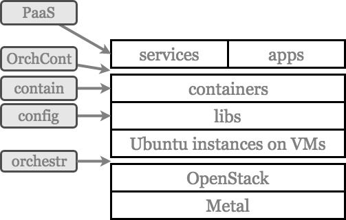

# Infrastructure - Deployment

**Considered components**: OpenStack, Docker (Images, Compose, Swarm), Kubernetes (K8s), Puppet, Chef, Ansible, Vagrant, Marathon, Terraform, SaltStack, Juju, CloudInit, Prometheus, Nagios, gRPC, Bukvik, OpenTracing, Jenkins

## Orchestr

Activity: **Orchestration**

Purpose: Provision all instances, networking and storage

Technology

+   OpenStack API (python)
+   No HEAT since it is not always available for an OpenStack cloud

## Config

Activity: **Configuration**

Purpose: Install libs, 3rd party services and configure/provision users, keys, …

Technology:

+   Ansible
+   Cloud-Init
    +   injected either trough Python+OpenStack API
    +   placed in manually in Open Stack Dashboard during the process of creating instance

## Contain

Activity: **Containers**

Purpose: install more complex 3pd party services, deploy our components and services

Technology:

+   Docker (images, compositions)

## OrchCont

Activity: **Containers Orchestration**

Purpose: Managing life-cycle and health of containers

**<u>NOTE</u>**: This is not necessary now, since we do not have reliability requirement at the moment, and if properly regarding our infrastructure design we will not suffer with later integration of this layer

Technology: 

+   K8s (Kubernets) through [KubeNow](https://github.com/kubenow/KubeNow)

## PaaS

Activity: **PaaS (Platform as a Service)**

Purpose: Standardize and simplify infrastructure by providing particular infrastructural components in an uniform way

Technology:

+   K8s (Kubernets) network and storage services
+   gRPC
+   proposal:
    +   Bukvik ([Bukvik as representation of ColaboFlow (paper draft)](http://bukvik.litterra.net/docs/Bukvik%20-%20ColaboFlow%20-%20Direction%20Self-organization.pdf)), [Bukvik website](http://bukvik.litterra.net/)
        +   it helps with safe, functional delivery of tasks related to research, processing, scalability of different responsibilities regarding the point of truth, privacy, processing, etc